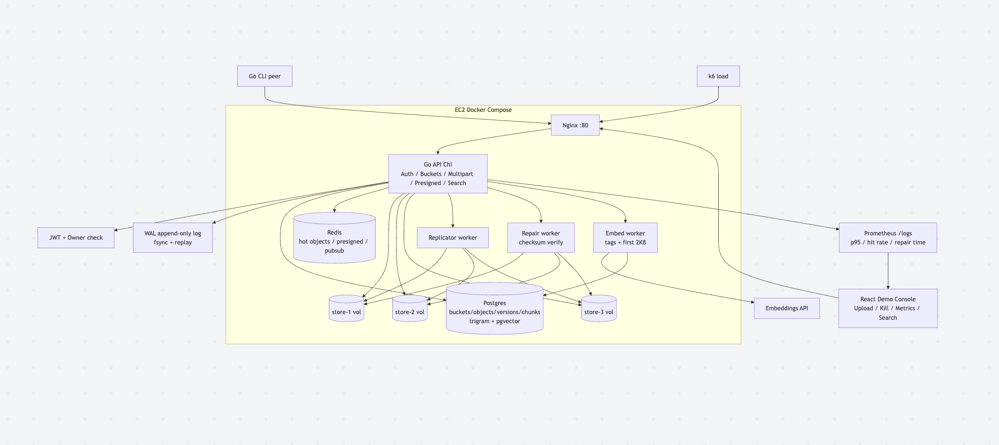

# Crash-Safe Object Store in Go

S3-core demo with durability proof. Not AWS parity, demo-scale.

## What it is
Go API + Postgres metadata + Redis cache + 3 Docker vols + React demo console.
Focus: multipart resumable, WAL replay after crash, replication + repair demo.

## Features
- Buckets/objects, JWT owner isolation, presigned URLs, checksums
- Multipart init/part/complete with resume
- Versioning + metadata search
- WAL append-only log with fsync + replay on restart
- Replicator + repair worker across store-1,2,3
- Select-lite filter + semantic search via pg_trgm + pgvector
- Demo console: upload, kill/heal, metrics, reset/seed

## Architecture

## Testing

```bash
make test    # go vet + every test, with the race detector
make lint    # static analysis
```

Some tests need a real Postgres and Redis. They skip themselves automatically
when those are not running, so `make test` always works. Start the services
with `make up` first to run the full set.

### The kinds of tests here

**Unit tests** — no database, no network, done in milliseconds. They check one
function in isolation. The config loader is tested this way.

**Handler tests** — call an HTTP handler directly with Go's `httptest` package,
so no real server or port is involved. `/health` is tested this way.

**Tests against real services** — anything involving SQL constraints or
transactions runs against an actual Postgres, never a fake one. A fake will
happily accept a duplicate row; a real database rejects it, and that rejection
is exactly the behaviour being relied on.

### Why they exist

A test is not there to prove the code works today. It is there to catch the day
it quietly stops working.

| Test | What it prevents |
|---|---|
| `/health` returns 503 when a dependency is down | a health check that reports "ok" while the database is unreachable, so deploys and monitoring silently trust a broken process |
| `/health` returns 200 when everything is up | the opposite mistake: a health check stuck permanently red |
| config defaults | demo mode, which exposes destructive controls, being switched on by accident |
| config rejects a missing database URL | a misconfigured server quietly connecting somewhere unintended instead of refusing to start |
| config reports every error at once | a change that makes it stop at the first error, so fixing config takes five restarts instead of one |

The pattern worth noticing: most of these are failures that produce **no error
message**. You would spot a health check wrongly returning 503 within seconds,
because nothing would start. You would not spot one wrongly returning 200.
Tests cover the direction you cannot see.

### Two flags worth knowing

- `-race` detects two goroutines touching the same memory without
  synchronisation. These bugs are random by nature — they pass a thousand times
  and corrupt data on the next run. This finds them reliably.
- `-count=1` turns off cached results, so every run is a real one.

### Still to come

Crash injection (kill the process mid-write, restart, prove no data was lost or
duplicated), write-ahead log replay against a log truncated at every possible
byte offset, idempotency checks that call each endpoint twice and compare the
final state, and end-to-end failure tests that stop a storage node and verify
the system repairs itself.
